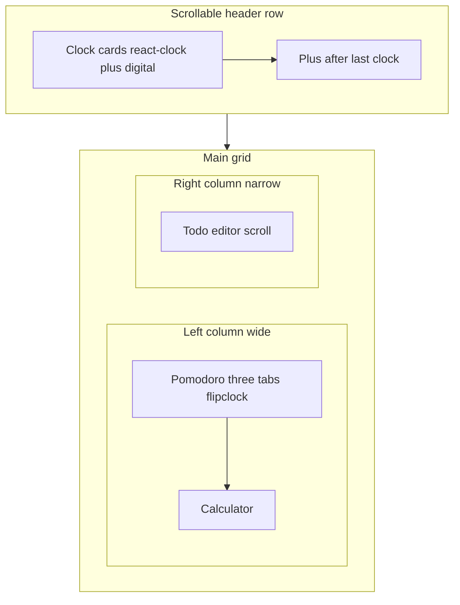

# Work Tools dashboard plan

## Context

The repo is a minimal [Next.js 16](https://nextjs.org) app (`package.json`: `next@16.2.1`, React 19, Tailwind 4). `app/page.tsx` is still the default template; `README.md` is a stub.

- Read Next.js 16 / App Router docs under `node_modules/next/dist/docs/` when implementing (per `[AGENTS.md](/Users/maciej/p/worktools/AGENTS.md)`).
- **Deployment model:** the app is **served only as static assets** — `**output: 'export'`** (or equivalent), **no server-side logic**, no reliance on Node at request time. Agents must treat this as a hard constraint (see **AGENTS.md**).
- **No runtime network:** Nothing in the app or its libraries may **fetch** fonts, images, or other assets **from the web** at runtime. Use `**next/font/local`** with `**woff`/`woff2` in the repo**; **no** `next/font/google` (avoids runtime dependence on Google font endpoints). **Do not** load images, scripts, styles, or connect to third-party origins for app functionality. Audit dependencies for hidden `fetch` to CDNs or remote APIs while the UI runs.
- **Timezones (no bundled list, no network):** use `**Intl.supportedValuesOf('timeZone')`** in supporting browsers to populate the `**Autocomplete` component from `@mantine/core`** (Mantine’s combobox-style **Autocomplete**). This API is **local to the runtime** (not an HTTP fetch). For environments without it, provide a **small static fallback list in source** (compiled into the bundle) only if required — prefer feature-detecting and using the API when present.
- **Offline:** Combine **(1) static file hosting**, **(2) HTTP cache headers** from the host/CDN policy for hashed assets, and **(3) a service worker** that caches the shell and build outputs so reload works without connectivity.
- **Content Security Policy:** Add a `**<meta http-equiv="Content-Security-Policy" content="...">`** in the **root layout** that **disallows loading assets/scripts from outside the app’s origin** (e.g. `**default-src 'self'`** and tighten `**script-src`**, `**style-src`**, `**font-src**`, `**img-src**`, `**connect-src**` to `**'self'**` only). **Place this `<meta>` as the first element inside `<head>`** so the policy is present **before** subsequent tags; Next/static export may inject extra `<head>` entries — **verify in the built `out/index.html`** that CSP applies as intended and adjust only with directives strictly required for hydration (e.g. if the framework needs `'unsafe-inline'` for scripts, document and minimize — **do not** add arbitrary third-party origins).

---

## Stack and architecture

| Area            | Choice                                                                                                                                                                                                                                                        |
| --------------- | ------------------------------------------------------------------------------------------------------------------------------------------------------------------------------------------------------------------------------------------------------------- |
| UI              | **Mantine** — `**Autocomplete` component** from `@mantine/core`, `Modal`, `Tabs`, `Input`, buttons, layout                                                                                                                                                    |
| State           | **Valtio** — **one store per feature**; mutations apply **immediately** in the proxy store; `**localStorage`**: **debounced or throttled writes for the daily todo list only**; **immediate** writes for all other persisted features (see Persistence below) |
| Logging         | **[loglevel](https://github.com/pimterry/loglevel)** — `**log.setLevel('warn')`** (or equivalent) as the baseline so console noise stays low; developers can raise verbosity locally when debugging                                                           |
| Math            | **math.js** (bundled), no `eval`                                                                                                                                                                                                                              |
| Analog clocks   | **[react-clock](https://github.com/wojtekmaj/react-clock)** (or maintained fork) per world-clock card                                                                                                                                                         |
| Pomodoro digits | **Flipclock**-family countdown UI — integrate a **flipclock** npm package or React flip-clock component so digits animate like classic flip clocks; must work with **static client bundle**                                                                   |
| Tests           | **Jest** — unit tests for **import schema** / migrations (see Task 6)                                                                                                                                                                                         |
| Code layout     | `**app/_components/`** (and optional `**app/_stores/`**)                                                                                                                                                                                                      |

---

## Persistence model (all stateful features)

- **Valtio / in-memory:** user edits and programmatic updates **apply immediately** to the relevant store so the UI always reflects the latest state.
- `**localStorage` — daily todo list only:** serializing the **todo** document should use **debouncing or throttling** (e.g. during rapid typing) to avoid jank and excessive I/O. **World clocks, pomodoro settings/counters, calculator state (if any), and import/export remain separate:** persist those slices with **immediate** `localStorage` writes on change (or on discrete actions), **not** the same debounced path as todos.
- **Durability on exit:** register `**beforeunload`**, `**pagehide`**, and where useful `**visibilitychange**`, to **flush any pending debounced todo persist synchronously** (one final write of the todo payload) so list edits are not lost when the tab or window closes.

---

## Dashboard layout (design)

**Phase-colored page background (driven by active pomodoro phase):**

- **Pomodoro (work):** red-tinted background
- **Short break:** green-tinted
- **Long break:** blue-tinted

Apply to the **root dashboard wrapper** (below Mantine provider) so the whole screen reflects focus state. Keep **text contrast accessible** (Mantine theme overrides or semi-transparent overlays as needed).

**Header (world clocks):**

- Full-width **header band** with a **single horizontal scroll container** (`overflow-x: auto` / `scroll`) so when there are **many clocks**, the user scrolls the header — **no wrapping** as the primary overflow strategy.
- Each configured clock is a **card/strip item** showing:
  - **Analog clock** via `**react-clock`**
  - **Digital time** (and date if useful) via `Intl` for that IANA zone
  - `**GMT±n` label** — offset **from UTC for that zone at the current instant** (handles DST; half-hour offsets allowed)
  - **User label** (editable inline or via popover — pick one pattern with Mantine)
- `**+` control:** placed **immediately after the last configured clock** in the **same scroll row** (not fixed to the viewport’s far right). Adding a clock uses `**Autocomplete` from `@mantine/core`** (the Mantine **Autocomplete** component: filterable **Input** + suggestions) over `**Intl.supportedValuesOf('timeZone')`** (with static fallback only if the API is missing), so the UI **prevents invalid timezone strings** without a separate failure mode.

**Main body — desktop (≥1024px): two columns**

- **Left (wide, primary):** **Pomodoro** is the **hero** — **large** typography and controls, in the spirit of [pomofocus.io](https://pomofocus.io), implemented with Mantine **Tabs** and a **flipclock**-style **mm:ss** display.
- **Directly under the pomodoro** (still in the left column): **Calculator** — **no physical calculator UI** (no keypad, no dedicated calculator layout/chrome). **Only** a **single** Mantine `**Input`**, plus read-only display of the **parse result** (what **math.js** accepts / normalizes) and the **calculation result** (numeric outcome).
- **Right (narrow):** **Daily todo** only — `**max-height`** + `**overflow-y: auto`**, **relatively small body text** so lines break less often in the narrow column.

**Pomodoro (each tab identical inside):**

- **Three tabs** — **Pomodoro** (work) · **Short break** · **Long break**.
- Each tab shows the **same layout:**
  - **Large flipclock** timer (**mm:ss**) for the **duration configured for that phase**
  - **Start / Pause / Resume** (one primary control reflecting state)
  - **Skip**
- **Durations** configurable (defaults e.g. 25 / 5 / 15 minutes), persisted.
- **Daily work time counter:** accumulate while the **work** phase is **running**; display **today’s total**; `**Date.now()`-based** countdown for accuracy when the tab is backgrounded; **date key** so totals reset at local midnight.
- **Tab switching while a phase is running:** pick one rule in implementation (e.g. pause on switch, or disable tabs until pause) — **no need for lengthy README** coverage.

**Permissions on load (critical):**

Shortly after **page load / root mount**, request `**Notification.requestPermission()`** for **desktop notifications** on phase end — **not** deferred until first phase completion. For **chime audio**, run the **audio unlock** path on load as well (**resume `AudioContext` / prime playback** where browsers allow); **do not** wait until the first chime to start this flow. If autoplay policy blocks sound until a gesture, document minimal fallback (e.g. one-time click unlock).

**Phase end — V1:**

- **Sound chime**
- `**Notification` API** desktop notification (title/body describing the completed phase)

**Bottom-right:**

- **Export** and **Import** buttons (fixed or in dashboard chrome) for backup/restore.

**Tablet / mobile:**

- **Vertical stack:** **Header clocks** → **Pomodoro** → **Calculator** → **Todo** (todo keeps **internal scroll** and compact type). Pomodoro remains visually dominant.

**Accessibility / motion:**

- Mantine components; `**aria-live`** region for calculator **parse** and **calculation** readouts; proper **tablist** semantics for pomodoro phases; respect `**prefers-reduced-motion`** for non-essential animation.

---

## Task 1 — Dependencies, static export, CSP, Mantine, loglevel, Jest, offline

- `**next.config`:** `output: 'export'` (adjust `images` if needed for static), `trailingSlash` as required by host.
- **CSP:** root `**layout.tsx`** — **first child of `<head>`** is `<meta httpEquiv="Content-Security-Policy" content="..." />` with directives that **block cross-origin asset/script loads**; validate built HTML and Next hydration constraints.
- Install **Mantine**, **valtio**, **loglevel**, **math.js**, **react-clock**, flipclock-capable package, **Jest** (+ **ts-jest** or **@swc/jest** as appropriate for Next/TS).
- `**app/_components/`**, **one valtio store per feature** (`app/_stores/` or colocated).
- `**MantineProvider`** (+ `@mantine/core` styles, `**ColorSchemeScript`** if used).
- **loglevel:** `**log.setLevel('warn')`** as default; adjust locally for debugging.
- **Local fonts only** in `app/layout.tsx`; remove Google font pipeline.
- **Offline strategy:** document/configure **static hosting**, **HTTP caching** for assets, and **service worker** cache of shell + bundles.
- **Jest** config + smoke test; schema tests under Task 6.

---

## Task 2 — World clock (header)

- **Horizontal scroll** row; per clock: `**react-clock`**, digital `**Intl`** time, **GMT±n**, user label.
- `**+`** inline after configured clocks; `**Autocomplete` from `@mantine/core`** on `**Intl.supportedValuesOf('timeZone')`** (+ minimal static fallback only if API unavailable).
- Persist clock list in `**localStorage`** with **immediate** writes; hydrate **valtio** world-clock store.

---

## Task 3 — Pomodoro + work counter + phase background + sound + notifications

- Mantine **Tabs**; **flipclock** countdown; **Start/Pause/Resume**; **Skip**.
- **Phase background** on root wrapper: work **red**, short **green**, long **blue**.
- **Page load:** `**Notification.requestPermission()`** + **audio unlock/init**.
- **Phase end:** **chime** + **desktop notification**.
- **Work-time accumulation** + **date key**; `**Date.now()` deltas** for countdown.
- Persist pomodoro settings and work totals to `**localStorage` immediately** on relevant changes (no debounce path shared with todos).

---

## Task 4 — Daily todo (editor list + rollover modal)

- **Persistence — one `localStorage` key per calendar day** holding JSON for **persisted items only** (e.g. id, text, done). The **trailing “fake” empty row is not part of this payload.**
- **Visuals:**
  - **Checkbox** on the left of each **persisted** item.
  - **Done:** **dimmed** text + **strikethrough**.
  - **Trailing row:** a **fake empty item** — **not persisted**; `**+` `ActionIcon`** instead of checkbox; **clicking `+` focuses** that input; creating a real item happens when the user commits non-empty text (e.g. **Enter** or **blur** with content — pick one consistent rule in implementation).
- **Editors:** **one Mantine `Input` (or `Textarea`) per persisted row** — **no `contenteditable`**.
- **Keyboard behavior (full spec):**
  - **Delete** at **end** of a **non-empty** item that is **not the last** → **merge with the next item**, inserting **a single space** between the joined texts; place caret at the join.
  - **Backspace** at **start** of a **non-empty** item that is **not the first** → **merge with the previous item**, inserting **a single space** between the joined texts; place caret at the join.
  - **Enter** at **beginning** of an item → insert a **new empty persisted item before** it and **focus** the **new** item’s input.
  - **Enter** at **end** of an item → insert a **new persisted item after** it and **focus** the **new** item’s input.
  - **Enter** in the **middle** of an item → **split** into two persisted items at the caret; **focus** the **start** of the **second** segment’s input.
  - **Delete** on an **empty persisted** item → **remove** the row; **focus the next** input (or sensible placement if there is no next).
  - **Backspace** on an **empty persisted** item → **remove** the row; **focus the previous** input.
  - **Escape** → **blur** the active input (**remove focus** only; **do not** delete a row with **Esc** alone).
- **Rollover (first activity of the day):**
On the **first `mousemove`** of a **new local calendar day**, track the day in `**localStorage`** (e.g. “last rollover prompt date”) and open a **Mantine `Modal`** that:
  1. **Congratulates** the user on **yesterday’s completed** tasks with a **short summary** (e.g. **counts**, and optionally **titles** of completed items).
  2. Asks whether **remaining (incomplete) tasks from yesterday** should be **appended to today’s list**, with **Yes / No** (or equivalent controls).
- **Not in scope:** a dedicated **“clear completed”** control.

---

## Task 5 — Calculator (prompt + result)

- **No physical calculator UI:** **no keypad**, **no calculator-style panel/layout** — **only**:
  - **One** Mantine text `**Input`** for the user’s expression.
  - Read-only **parse result** line (how **math.js** interprets / normalizes the input — string suitable for display).
  - Read-only **calculation result** line (numeric or other outcome from **math.js**).
- **Evaluate** on **Enter** (optional: also on blur if desired; avoid noisy live re-eval on every keystroke unless explicitly chosen).
- **Errors:** show **user-visible** feedback when **math.js** rejects input (no thrown errors leaking as raw stacks).
- **Valtio** store for last input/result **optional** but consistent with other tools.
- `**aria-live`** on the result region for screen readers.

---

## Task 6 — Data import / export

- **Export:** serialize a **versioned** snapshot (all relevant stores/keys: clocks, pomodoro settings, work totals by date, todos by day, calculator prefs if any) to downloadable JSON.
- **Import:** **backwards compatible** — older shapes via explicit `**version` field** and **migration functions** (`v1 → v2 → latest`).
- **Testing:** **Whenever the export/import schema changes, add a new Jest unit test** that imports at least one **fixture** representing the **previous** version and asserts migration to the **current** shape. Keep fixtures in e.g. `**__fixtures__/export-vN.json`**.
- Document obligation in `**AGENTS.md`**.

---

## Task 7 — Dashboard shell

- `**app/page.tsx`:** compose **scrollable header**, **two-column body** (**pomodoro** → **calculator** | **todo**), **phase-colored** root from pomodoro store, **Import/Export** **bottom-right**, responsive stack on small screens.

---

## Task 8 — README.md

- **What it is**, prerequisites, `**npm` scripts**, **high-level feature bullets**, **local-only data** + note that **todo `localStorage` is debounced/throttled with a flush on tab close**, **CSP** mention, **static deploy** (hosting + cache + SW), **stack** (Next, React, Tailwind, Mantine, Valtio, loglevel, math.js, react-clock, flipclock, Jest).
- **Omit** long **per-tool** how-to sections (stale risk).

---

## Suggested implementation order

1. Static export + **CSP** + local fonts + Mantine + **loglevel** + **offline triple** (hosting/cache/SW) + Jest baseline
2. Val stores + **todo persistence helpers** (debounce/throttle + flush on unload) + import/export **v1** + first Jest import test
3. Pomodoro (flipclock, bg, notifications + audio at load, phase end)
4. World clocks (**react-clock**, Mantine `**Autocomplete` component** from `**Intl.supportedValuesOf`**)
5. Todo editor + rollover modal
6. Calculator (**math.js**)
7. README + polish (CSP verification in `out/`, contrast, **a11y**, reduced motion)

---

## Note on flipclock npm ecosystem

Many **flipclock** packages predate React. If the chosen package is imperative/DOM-based, wrap it in a small `**useEffect` / ref** integration or prefer a **React** flip-digit component that matches the visual. Requirement: **flipclock-style** animated digits for the pomodoro countdown, **fully offline** in the bundle (no remote assets).